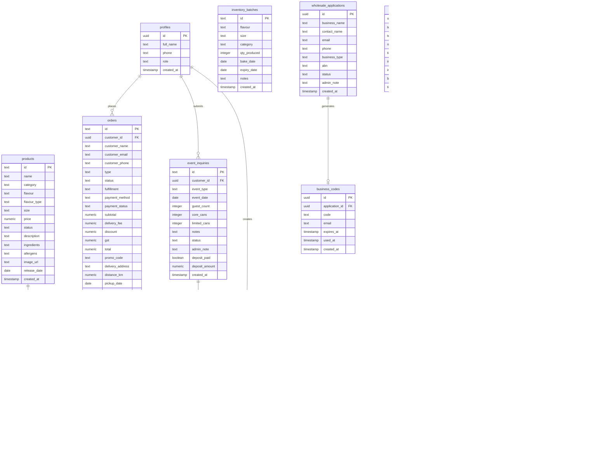

# LÄYRD — Backend Schema

> **Document Type:** Backend Database Schema  
> **Version:** 1.0  
> **Folder:** `g:/layrd-v1/imp doc/`  
> **Last Updated:** July 2026  
> **Database:** Supabase (PostgreSQL 15)  
> **Cross-reference:** [TRD.md](./TRD.md) · [PRD.md](./PRD.md)

---

## Overview

The LÄYRD backend uses **Supabase** (hosted PostgreSQL) as its primary database. All tables live in the `public` schema. Supabase Auth handles identity — the `auth.users` table is managed by Supabase; the `profiles` table extends it with application-specific fields.

### Table Inventory

| Table | Purpose |
|---|---|
| `profiles` | Extended user profiles (role, name, phone) |
| `products` | All sellable items (cans, bundles, espresso) |
| `orders` | Customer order headers |
| `order_items` | Line items belonging to each order |
| `inventory_batches` | Production batches (source of stock) |
| `event_inquiries` | Private event catering requests |
| `ai_label_requests` | Customer AI label submissions per event |
| `wholesale_applications` | B2B account applications |
| `business_codes` | One-time verification codes for wholesale |
| `promo_codes` | Discount codes (%, fixed, free delivery) |
| `availability_slots` | Bookable time slots for pickup/delivery |
| `settings` | Single-row store configuration |

---

## Entity Relationship Diagram



---

## Table Definitions

---

### `profiles`

Extends Supabase's `auth.users`. Created automatically on user sign-up via a trigger.

```sql
create table public.profiles (
  id          uuid primary key references auth.users(id) on delete cascade,
  full_name   text,
  phone       text,
  role        text not null default 'customer'
                check (role in ('customer', 'business', 'admin')),
  created_at  timestamptz not null default now()
);
```

| Column | Type | Constraints | Description |
|---|---|---|---|
| `id` | `uuid` | PK, FK → `auth.users.id` | Matches Supabase Auth user ID |
| `full_name` | `text` | | Customer's display name |
| `phone` | `text` | | Optional contact number |
| `role` | `text` | NOT NULL, CHECK | `customer` / `business` / `admin` |
| `created_at` | `timestamptz` | NOT NULL, DEFAULT now() | |

**Auto-create trigger:**
```sql
create or replace function public.handle_new_user()
returns trigger as $$
begin
  insert into public.profiles (id, full_name)
  values (new.id, new.raw_user_meta_data->>'full_name');
  return new;
end;
$$ language plpgsql security definer;

create trigger on_auth_user_created
  after insert on auth.users
  for each row execute procedure public.handle_new_user();
```

---

### `products`

All sellable products: 250ml cans, 150ml event cans, espresso shots. Bundles are not rows here — they are assembled on the frontend from individual flavours.

```sql
create table public.products (
  id           text primary key,                    -- e.g. 'lotus-250'
  name         text not null,
  category     text not null
                 check (category in ('cake', 'espresso', 'bundle')),
  flavour      text not null,
  flavour_type text not null
                 check (flavour_type in ('core', 'limited')),
  size         text not null,                       -- '150ml', '250ml', '330ml', '60ml'
  price        numeric(8,2) not null,
  status       text not null default 'Available'
                 check (status in ('Available', 'Coming Soon', 'Sold Out', 'Hidden')),
  description  text,
  ingredients  text,
  allergens    text,
  image_url    text,                                -- Supabase Storage URL
  release_date date,                               -- For Coming Soon countdown
  created_at   timestamptz not null default now()
);
```

| Column | Type | Notes |
|---|---|---|
| `id` | `text` PK | Slug: `lotus-250`, `espresso-1` |
| `name` | `text` NOT NULL | Display name |
| `category` | `text` NOT NULL | `cake` / `espresso` / `bundle` |
| `flavour` | `text` NOT NULL | e.g. `Lotus Cheesecake` |
| `flavour_type` | `text` NOT NULL | `core` ($8) or `limited` ($9) |
| `size` | `text` NOT NULL | `150ml` / `250ml` / `330ml` / `60ml` |
| `price` | `numeric(8,2)` NOT NULL | Retail price per unit in CAD |
| `status` | `text` NOT NULL | Available / Coming Soon / Sold Out / Hidden |
| `description` | `text` | Product description |
| `ingredients` | `text` | Ingredient list |
| `allergens` | `text` | Comma-separated allergen list |
| `image_url` | `text` | Supabase Storage CDN URL |
| `release_date` | `date` | For Coming Soon display |
| `created_at` | `timestamptz` | |

**Indexes:**
```sql
create index idx_products_status   on public.products(status);
create index idx_products_category on public.products(category);
create index idx_products_flavour_type on public.products(flavour_type);
```

---

### `orders`

Order header. One row per order regardless of type (regular, event, wholesale).

```sql
create table public.orders (
  id               text primary key,               -- e.g. 'ORD-2026-001'
  customer_id      uuid references public.profiles(id),
  customer_name    text not null,
  customer_email   text not null,
  customer_phone   text,
  type             text not null default 'regular'
                     check (type in ('regular', 'event', 'wholesale')),
  status           text not null default 'New'
                     check (status in (
                       'New', 'Paid', 'Pending Payment', 'Preparing',
                       'Ready for Pickup', 'Out for Delivery',
                       'Completed', 'Cancelled', 'Refunded'
                     )),
  fulfillment      text not null
                     check (fulfillment in ('pickup', 'delivery')),
  payment_method   text not null
                     check (payment_method in ('stripe', 'etransfer', 'cash')),
  payment_status   text not null default 'Unpaid'
                     check (payment_status in ('Paid', 'Unpaid', 'Pending Payment', 'Refunded')),
  subtotal         numeric(8,2) not null default 0,
  delivery_fee     numeric(8,2) not null default 0,
  discount         numeric(8,2) not null default 0,
  gst              numeric(8,2) not null default 0,
  total            numeric(8,2) not null default 0,
  promo_code       text,
  delivery_address text,
  distance_km      numeric(6,2),
  pickup_date      date not null,
  pickup_time      text not null,
  notes            text,
  stripe_session_id text,
  created_at       timestamptz not null default now()
);
```

| Column | Type | Notes |
|---|---|---|
| `id` | `text` PK | Human-readable: `ORD-2026-001` (auto-generated via trigger) |
| `customer_id` | `uuid` FK | Nullable for guest checkouts |
| `customer_name/email/phone` | `text` | Denormalised — stored at order time |
| `type` | `text` | `regular` / `event` / `wholesale` |
| `status` | `text` | See order lifecycle |
| `fulfillment` | `text` | `pickup` or `delivery` |
| `payment_method` | `text` | `stripe` / `etransfer` / `cash` |
| `payment_status` | `text` | `Paid` / `Unpaid` / `Pending Payment` / `Refunded` |
| `subtotal` | `numeric(8,2)` | Before discount + delivery |
| `delivery_fee` | `numeric(8,2)` | 0 for pickup orders |
| `discount` | `numeric(8,2)` | Promo code saving |
| `gst` | `numeric(8,2)` | 5% applied post-discount |
| `total` | `numeric(8,2)` | Final amount charged |
| `promo_code` | `text` | Code used (if any) |
| `delivery_address` | `text` | Full address string for delivery |
| `distance_km` | `numeric(6,2)` | Google Maps distance (for audit) |
| `pickup_date` | `date` NOT NULL | |
| `pickup_time` | `text` NOT NULL | e.g. `3:00 PM` |
| `notes` | `text` | Customer special instructions |
| `stripe_session_id` | `text` | Stripe Checkout Session ID |
| `created_at` | `timestamptz` | |

**Auto-ID trigger:**
```sql
create sequence orders_seq start 1;

create or replace function generate_order_id()
returns trigger as $$
begin
  new.id := 'ORD-' || to_char(now(), 'YYYY') || '-' || lpad(nextval('orders_seq')::text, 3, '0');
  return new;
end;
$$ language plpgsql;

create trigger set_order_id
  before insert on public.orders
  for each row
  when (new.id is null)
  execute function generate_order_id();
```

**Indexes:**
```sql
create index idx_orders_customer_id on public.orders(customer_id);
create index idx_orders_status      on public.orders(status);
create index idx_orders_type        on public.orders(type);
create index idx_orders_created_at  on public.orders(created_at desc);
create index idx_orders_pickup_date on public.orders(pickup_date);
```

---

### `order_items`

One row per product line within an order.

```sql
create table public.order_items (
  id          uuid primary key default gen_random_uuid(),
  order_id    text not null references public.orders(id) on delete cascade,
  product_id  text references public.products(id),
  name        text not null,
  flavour     text not null,
  size        text not null,
  category    text not null
                check (category in ('cake', 'espresso', 'bundle')),
  type        text not null
                check (type in ('can', 'bundle', 'espresso')),
  quantity    integer not null check (quantity > 0),
  unit_price  numeric(8,2) not null,
  sweetness   text,               -- Espresso only: 'Black', 'Sugar', 'Stevia', 'Brown Sugar'
  created_at  timestamptz not null default now()
);
```

| Column | Type | Notes |
|---|---|---|
| `id` | `uuid` PK | |
| `order_id` | `text` FK → `orders.id` | Cascades on delete |
| `product_id` | `text` FK → `products.id` | Nullable for custom/event items |
| `name` | `text` NOT NULL | Snapshot of product name at order time |
| `flavour` | `text` NOT NULL | For inventory matching |
| `size` | `text` NOT NULL | `150ml` / `250ml` / etc. |
| `category` | `text` NOT NULL | `cake` / `espresso` / `bundle` |
| `type` | `text` NOT NULL | `can` / `bundle` / `espresso` |
| `quantity` | `integer` NOT NULL | Must be > 0 |
| `unit_price` | `numeric(8,2)` NOT NULL | Price per unit at order time |
| `sweetness` | `text` | Espresso customisation |
| `created_at` | `timestamptz` | |

**Indexes:**
```sql
create index idx_order_items_order_id on public.order_items(order_id);
create index idx_order_items_flavour  on public.order_items(flavour, size, category);
```

**Stock calculation view:**
```sql
-- View: committed order items (excludes Cancelled and Refunded)
create or replace view public.committed_order_items as
  select oi.*
  from public.order_items oi
  join public.orders o on o.id = oi.order_id
  where o.status not in ('Cancelled', 'Refunded');
```

---

### `inventory_batches`

Every production run Adam logs. Stock is never stored directly — it is always calculated.

```sql
create table public.inventory_batches (
  id           text primary key,                   -- e.g. 'batch-20260608-001'
  flavour      text not null,
  size         text not null,
  category     text not null
                 check (category in ('cake', 'espresso')),
  qty_produced integer not null check (qty_produced > 0),
  bake_date    date not null,
  expiry_date  date not null,
  notes        text,
  created_at   timestamptz not null default now()
);
```

| Column | Type | Notes |
|---|---|---|
| `id` | `text` PK | Auto-generated slug |
| `flavour` | `text` NOT NULL | Must match product flavour name exactly for stock calc |
| `size` | `text` NOT NULL | `150ml` / `250ml` / `330ml` |
| `category` | `text` NOT NULL | `cake` or `espresso` |
| `qty_produced` | `integer` NOT NULL | Units baked in this batch |
| `bake_date` | `date` NOT NULL | Production date |
| `expiry_date` | `date` NOT NULL | Best before date |
| `notes` | `text` | Adam's batch notes |
| `created_at` | `timestamptz` | |

**Indexes:**
```sql
create index idx_batches_flavour   on public.inventory_batches(flavour, size, category);
create index idx_batches_bake_date on public.inventory_batches(bake_date desc);
```

**Stock summary function (replaces `calculateStock()` in JS):**
```sql
create or replace function public.get_stock_summary()
returns table (
  flavour        text,
  size           text,
  category       text,
  total_produced bigint,
  committed      bigint,
  available      bigint,
  status         text
) as $$
begin
  return query
  with produced as (
    select flavour, size, category, sum(qty_produced) as total
    from public.inventory_batches
    group by flavour, size, category
  ),
  committed_qty as (
    select oi.flavour, oi.size, oi.category, sum(oi.quantity) as total
    from public.committed_order_items oi
    group by oi.flavour, oi.size, oi.category
  )
  select
    p.flavour,
    p.size,
    p.category,
    p.total as total_produced,
    coalesce(c.total, 0) as committed,
    greatest(0, p.total - coalesce(c.total, 0)) as available,
    case
      when greatest(0, p.total - coalesce(c.total, 0)) = 0 then 'Out'
      when greatest(0, p.total - coalesce(c.total, 0)) <= 5 then 'Low'
      else 'OK'
    end as status
  from produced p
  left join committed_qty c
    on p.flavour = c.flavour and p.size = c.size and p.category = c.category
  order by
    case when greatest(0, p.total - coalesce(c.total, 0)) = 0 then 0
         when greatest(0, p.total - coalesce(c.total, 0)) <= 5 then 1
         else 2 end,
    p.flavour;
end;
$$ language plpgsql stable;
```

---

### `event_inquiries`

Private event catering requests submitted by logged-in customers.

```sql
create table public.event_inquiries (
  id             text primary key,               -- e.g. 'EVT-2026-001'
  customer_id    uuid not null references public.profiles(id),
  event_type     text not null,
  event_date     date not null,
  guest_count    integer,
  core_cans      integer not null default 0 check (core_cans >= 0),
  limited_cans   integer not null default 0 check (limited_cans >= 0),
  notes          text,
  status         text not null default 'Pending'
                   check (status in ('Pending', 'Approved', 'Rejected')),
  admin_note     text,
  deposit_paid   boolean not null default false,
  deposit_amount numeric(8,2),
  created_at     timestamptz not null default now(),
  constraint min_cans check (core_cans + limited_cans >= 24)
);
```

| Column | Type | Notes |
|---|---|---|
| `id` | `text` PK | Auto-generated: `EVT-2026-001` |
| `customer_id` | `uuid` FK NOT NULL | Must be logged in to submit |
| `event_type` | `text` NOT NULL | Birthday / Wedding / Corporate / etc. |
| `event_date` | `date` NOT NULL | Must be ≥ 5 business days from submission |
| `guest_count` | `integer` | Estimated guests |
| `core_cans` | `integer` | $5/can (150ml) |
| `limited_cans` | `integer` | $6/can (150ml) |
| `notes` | `text` | Customer instructions |
| `status` | `text` | `Pending` / `Approved` / `Rejected` |
| `admin_note` | `text` | Adam's approval/rejection message |
| `deposit_paid` | `boolean` | True after 50% deposit confirmed |
| `deposit_amount` | `numeric(8,2)` | 50% of estimated total |
| `created_at` | `timestamptz` | |
| CONSTRAINT | | `core_cans + limited_cans >= 24` |

**Auto-ID trigger (same pattern as orders):**
```sql
create sequence event_seq start 1;
-- Apply trigger similar to orders to generate EVT-YYYY-NNN
```

**Indexes:**
```sql
create index idx_events_customer_id on public.event_inquiries(customer_id);
create index idx_events_status      on public.event_inquiries(status);
create index idx_events_event_date  on public.event_inquiries(event_date);
```

---

### `ai_label_requests`

Label text submissions from customers for their approved events.

```sql
create table public.ai_label_requests (
  id                    uuid primary key default gen_random_uuid(),
  event_inquiry_id      text not null references public.event_inquiries(id) on delete cascade,
  customer_id           uuid not null references public.profiles(id),
  tone                  text not null,
  event_type            text,
  customer_name_on_label text,
  generated_text        text not null,
  status                text not null default 'Pending'
                          check (status in ('Pending', 'Approved', 'Revision Requested')),
  admin_note            text,
  created_at            timestamptz not null default now(),
  constraint label_length check (char_length(generated_text) <= 200)
);
```

| Column | Type | Notes |
|---|---|---|
| `id` | `uuid` PK | |
| `event_inquiry_id` | `text` FK NOT NULL | Must link to an approved event |
| `customer_id` | `uuid` FK NOT NULL | |
| `tone` | `text` NOT NULL | Elegant / Romantic / Playful / Luxury / Minimal / Birthday / Wedding / Corporate |
| `event_type` | `text` | From the label studio form |
| `customer_name_on_label` | `text` | Optional personalisation |
| `generated_text` | `text` NOT NULL | Final submitted label text |
| `status` | `text` | `Pending` / `Approved` / `Revision Requested` |
| `admin_note` | `text` | Adam's feedback |
| `created_at` | `timestamptz` | |
| CONSTRAINT | | `char_length(generated_text) <= 200` |

**Indexes:**
```sql
create index idx_labels_event_id   on public.ai_label_requests(event_inquiry_id);
create index idx_labels_status     on public.ai_label_requests(status);
create index idx_labels_customer   on public.ai_label_requests(customer_id);
```

---

### `wholesale_applications`

Business account applications from cafés, restaurants, and retailers.

```sql
create table public.wholesale_applications (
  id            uuid primary key default gen_random_uuid(),
  business_name text not null,
  contact_name  text not null,
  email         text not null,
  phone         text,
  business_type text not null,             -- café, restaurant, retailer, food service, corporate
  abn           text,                      -- Alberta Business Number (optional)
  status        text not null default 'Pending'
                  check (status in ('Pending', 'Approved', 'Rejected')),
  admin_note    text,
  created_at    timestamptz not null default now()
);
```

| Column | Type | Notes |
|---|---|---|
| `id` | `uuid` PK | |
| `business_name` | `text` NOT NULL | |
| `contact_name` | `text` NOT NULL | Primary contact |
| `email` | `text` NOT NULL | Receives verification code on approval |
| `phone` | `text` | |
| `business_type` | `text` NOT NULL | café / restaurant / retailer / food service / corporate |
| `abn` | `text` | Alberta Business Number — optional |
| `status` | `text` | `Pending` / `Approved` / `Rejected` |
| `admin_note` | `text` | Adam's decision note |
| `created_at` | `timestamptz` | |

**Indexes:**
```sql
create index idx_wholesale_status on public.wholesale_applications(status);
create index idx_wholesale_email  on public.wholesale_applications(email);
```

---

### `business_codes`

One-time verification codes sent to approved wholesale businesses. Expires 48 hours after creation.

```sql
create table public.business_codes (
  id             uuid primary key default gen_random_uuid(),
  application_id uuid not null references public.wholesale_applications(id),
  code           text not null unique,
  email          text not null,
  expires_at     timestamptz not null
                   default (now() + interval '48 hours'),
  used_at        timestamptz,
  created_at     timestamptz not null default now()
);
```

| Column | Type | Notes |
|---|---|---|
| `id` | `uuid` PK | |
| `application_id` | `uuid` FK NOT NULL | Links back to the application |
| `code` | `text` UNIQUE | Short random code e.g. `LAYRD-X7K2` |
| `email` | `text` NOT NULL | Email it was sent to |
| `expires_at` | `timestamptz` | 48 hours from creation |
| `used_at` | `timestamptz` | Null = unused; timestamp = when used |
| `created_at` | `timestamptz` | |

**Code generation (in API route):**
```javascript
// Generates a unique, human-friendly code
const code = 'LAYRD-' + Math.random().toString(36).toUpperCase().slice(2, 6);
```

**Expiry cron (Supabase pg_cron):**
```sql
-- Runs every hour — marks expired codes in logs (soft approach; enforce in app)
-- Or handle in the API route: if expires_at < now() → reject code
```

**Index:**
```sql
create index idx_biz_codes_code  on public.business_codes(code);
create index idx_biz_codes_email on public.business_codes(email);
```

---

### `promo_codes`

Customer-facing discount codes managed by Adam.

```sql
create table public.promo_codes (
  id           uuid primary key default gen_random_uuid(),
  code         text not null unique,
  type         text not null
                 check (type in ('percentage', 'fixed', 'free_delivery')),
  value        numeric(6,2) not null default 0,  -- 10 = 10% off OR $10 off
  expires_at   timestamptz,
  usage_limit  integer,                           -- Null = unlimited
  times_used   integer not null default 0,
  active       boolean not null default true,
  created_at   timestamptz not null default now()
);
```

| Column | Type | Notes |
|---|---|---|
| `id` | `uuid` PK | |
| `code` | `text` UNIQUE | Case-insensitive matching recommended |
| `type` | `text` NOT NULL | `percentage` / `fixed` / `free_delivery` |
| `value` | `numeric(6,2)` | `10` = 10% off or $10 off; ignored for `free_delivery` |
| `expires_at` | `timestamptz` | Null = no expiry |
| `usage_limit` | `integer` | Null = unlimited uses |
| `times_used` | `integer` | Auto-incremented on each valid use |
| `active` | `boolean` | Admin can deactivate without deleting |
| `created_at` | `timestamptz` | |

**Validation logic (in API route):**
```javascript
// Code is valid if:
// 1. active = true
// 2. expires_at IS NULL OR expires_at > now()
// 3. usage_limit IS NULL OR times_used < usage_limit
```

**Index:**
```sql
create index idx_promo_code   on public.promo_codes(code);
create index idx_promo_active on public.promo_codes(active);
```

---

### `availability_slots`

Time slots Adam opens for customer orders. Customers see only available slots.

```sql
create table public.availability_slots (
  id          uuid primary key default gen_random_uuid(),
  slot_date   date not null,
  time_slot   text not null,                -- '11:00 AM', '1:00 PM', '3:00 PM', '5:00 PM', '7:00 PM'
  available   boolean not null default true,
  max_orders  integer,                     -- Optional cap per slot
  created_at  timestamptz not null default now(),
  unique (slot_date, time_slot)
);
```

| Column | Type | Notes |
|---|---|---|
| `id` | `uuid` PK | |
| `slot_date` | `date` NOT NULL | Calendar date of the slot |
| `time_slot` | `text` NOT NULL | `11:00 AM` / `1:00 PM` / `3:00 PM` / `5:00 PM` / `7:00 PM` |
| `available` | `boolean` NOT NULL | `false` = hidden from customer picker |
| `max_orders` | `integer` | Optional cap; null = unlimited |
| `created_at` | `timestamptz` | |
| UNIQUE | | `(slot_date, time_slot)` — one row per slot |

**Default slots SQL (seed):**
```sql
-- Seed upcoming week with default slots
insert into public.availability_slots (slot_date, time_slot, available)
select
  current_date + generate_series(1, 14) as slot_date,
  unnest(array['11:00 AM', '1:00 PM', '3:00 PM', '5:00 PM', '7:00 PM']) as time_slot,
  true as available;
```

**Index:**
```sql
create index idx_slots_date      on public.availability_slots(slot_date);
create index idx_slots_available on public.availability_slots(slot_date, available);
```

---

### `settings`

Single-row table. Always upsert on `id = 1`.

```sql
create table public.settings (
  id               integer primary key default 1,
  store_email      text not null default 'info@layrd.org',
  store_phone      text not null default '403-399-3903',
  social_handle    text not null default '@l.a.y.r.d',
  pickup_area      text not null default 'Pineridge NE, Calgary',
  pickup_address   text,                    -- Private — sent post-order only
  gst_rate         numeric(4,2) not null default 5.00,
  delivery_enabled boolean not null default true,
  delivery_tiers   jsonb not null default '[
    {"maxKm": 5,  "fee": 5},
    {"maxKm": 10, "fee": 10},
    {"maxKm": 15, "fee": 15},
    {"maxKm": 20, "fee": 20},
    {"maxKm": 25, "fee": 25},
    {"maxKm": 999999, "fee": 30}
  ]',
  updated_at       timestamptz not null default now(),
  constraint single_row check (id = 1)
);

-- Seed the single row
insert into public.settings (id) values (1) on conflict (id) do nothing;
```

| Column | Type | Notes |
|---|---|---|
| `id` | `integer` PK | Always `1` — enforced by CHECK constraint |
| `store_email` | `text` | Shown publicly |
| `store_phone` | `text` | Shown publicly |
| `social_handle` | `text` | Instagram handle |
| `pickup_area` | `text` | Public (for delivery distance origin) |
| `pickup_address` | `text` | Private — included in order confirmation email only |
| `gst_rate` | `numeric(4,2)` | Default 5.00 (%) |
| `delivery_enabled` | `boolean` | Global delivery on/off switch |
| `delivery_tiers` | `jsonb` | Array of `{maxKm, fee}` objects |
| `updated_at` | `timestamptz` | Updated on every save |

---

## Row Level Security (RLS) Policies

Enable RLS on all tables. Anon key is used on the client — RLS enforces access.

```sql
-- Enable RLS on all tables
alter table public.profiles            enable row level security;
alter table public.products            enable row level security;
alter table public.orders              enable row level security;
alter table public.order_items         enable row level security;
alter table public.inventory_batches   enable row level security;
alter table public.event_inquiries     enable row level security;
alter table public.ai_label_requests   enable row level security;
alter table public.wholesale_applications enable row level security;
alter table public.business_codes      enable row level security;
alter table public.promo_codes         enable row level security;
alter table public.availability_slots  enable row level security;
alter table public.settings            enable row level security;
```

### Policy Definitions

```sql
-- ── profiles ──────────────────────────────────────────
-- Users can only read/update their own profile
create policy "profiles: own row" on public.profiles
  for all using (auth.uid() = id);

-- Admins can read all profiles (via service role — bypass RLS)

-- ── products ──────────────────────────────────────────
-- Public can read available/coming soon products
create policy "products: public read" on public.products
  for select using (status in ('Available', 'Coming Soon'));

-- Admins write via service role (bypasses RLS)

-- ── orders ────────────────────────────────────────────
-- Customers can see their own orders
create policy "orders: own read" on public.orders
  for select using (auth.uid() = customer_id);

-- Customers can insert orders
create policy "orders: insert" on public.orders
  for insert with check (auth.uid() = customer_id);

-- ── order_items ───────────────────────────────────────
create policy "order_items: own read" on public.order_items
  for select using (
    order_id in (
      select id from public.orders where customer_id = auth.uid()
    )
  );

create policy "order_items: insert with own order" on public.order_items
  for insert with check (
    order_id in (
      select id from public.orders where customer_id = auth.uid()
    )
  );

-- ── event_inquiries ────────────────────────────────────
create policy "events: own read" on public.event_inquiries
  for select using (auth.uid() = customer_id);

create policy "events: insert" on public.event_inquiries
  for insert with check (auth.uid() = customer_id);

-- ── ai_label_requests ──────────────────────────────────
create policy "labels: own read" on public.ai_label_requests
  for select using (auth.uid() = customer_id);

create policy "labels: insert" on public.ai_label_requests
  for insert with check (auth.uid() = customer_id);

-- ── wholesale_applications ─────────────────────────────
-- Anyone can submit; only service role reads all
create policy "wholesale: insert open" on public.wholesale_applications
  for insert with check (true);

-- ── promo_codes ────────────────────────────────────────
-- Public can read active codes (to validate at checkout)
create policy "promos: active read" on public.promo_codes
  for select using (active = true);

-- ── availability_slots ─────────────────────────────────
-- Public can read available slots
create policy "slots: public read" on public.availability_slots
  for select using (available = true);

-- ── settings ───────────────────────────────────────────
-- Public can read settings (pickup area, gst rate etc.)
create policy "settings: public read" on public.settings
  for select using (true);

-- inventory_batches, business_codes — admin only (service role, no RLS needed)
```

---

## Supabase Storage Buckets

```sql
-- Product images bucket (public read)
insert into storage.buckets (id, name, public)
values ('product-images', 'product-images', true);

-- Label artwork bucket (private)
insert into storage.buckets (id, name, public)
values ('label-artwork', 'label-artwork', false);
```

| Bucket | Public | Used For |
|---|---|---|
| `product-images` | ✅ Yes | Product can images displayed on shop |
| `label-artwork` | ❌ No | AI label final artwork files (if generated) |

**Storage path convention:**
```
product-images/{product-id}.jpg          → e.g. product-images/lotus-250.jpg
label-artwork/{event-id}/{label-id}.png  → e.g. label-artwork/EVT-2026-001/uuid.png
```

---

## Seed Data

### Products seed

```sql
insert into public.products (id, name, category, flavour, flavour_type, size, price, status, description, allergens)
values
  ('lotus-250',    'Lotus Cheesecake',    'cake',     'Lotus Cheesecake',    'core',    '250ml', 8.00, 'Available',   'Velvety cream cheese layered over Biscoff crust with Lotus spread.',     'Dairy, Gluten, Soy'),
  ('oreo-250',     'Oreo Cheesecake',     'cake',     'Oreo Cheesecake',     'core',    '250ml', 8.00, 'Available',   'Classic Oreo blended into smooth cream cheese filling.',                 'Dairy, Gluten, Soy'),
  ('tiramisu-250', 'Classic Tiramisu',    'cake',     'Classic Tiramisu',    'core',    '250ml', 8.00, 'Available',   'Espresso ladyfingers with mascarpone cream and cocoa.',                  'Dairy, Gluten, Eggs'),
  ('bueno-250',    'Bueno Cheesecake',    'cake',     'Bueno Cheesecake',    'limited', '250ml', 9.00, 'Available',   'Kinder Bueno hazelnut chocolate in a silky cheesecake.',                 'Dairy, Gluten, Nuts, Soy'),
  ('matcha-250',   'Matcha Cheesecake',   'cake',     'Matcha Cheesecake',   'limited', '250ml', 9.00, 'Coming Soon', 'Ceremonial-grade matcha in a smooth, lightly sweet cheesecake.',         'Dairy, Gluten, Soy'),
  ('pistachio-250','Pistachio Tiramisu',  'cake',     'Pistachio Tiramisu',  'limited', '250ml', 9.00, 'Coming Soon', 'Traditional tiramisu elevated with Sicilian pistachio cream.',           'Dairy, Gluten, Nuts, Eggs'),
  ('espresso-1',   'Espresso Shot × 1',  'espresso', 'Espresso',            'core',    '60ml',  4.00, 'Available',   'Single fresh espresso shot. Choose your sweetness preference.',          'None'),
  ('espresso-4',   'Espresso Shots × 4', 'espresso', 'Espresso',            'core',    '60ml', 14.00, 'Available',   'Four fresh espresso shots. Choose your sweetness preference.',           'None'),
  ('espresso-6',   'Espresso Shots × 6', 'espresso', 'Espresso',            'core',    '60ml', 20.00, 'Available',   'Six fresh espresso shots. Choose your sweetness preference.',            'None');
```

### Settings seed

```sql
insert into public.settings (id, store_email, store_phone, social_handle, pickup_area, gst_rate, delivery_enabled)
values (1, 'info@layrd.org', '403-399-3903', '@l.a.y.r.d', 'Pineridge NE, Calgary', 5.00, true)
on conflict (id) do nothing;
```

---

## Migration Checklist

Run these in order when setting up Supabase for the first time:

```
1. [ ] Enable UUID extension:      create extension if not exists "pgcrypto";
2. [ ] Enable pg_cron extension:   (Enable in Supabase Dashboard → Extensions)
3. [ ] Create tables:              Run CREATE TABLE statements above in order
4. [ ] Create sequences:           orders_seq, event_seq
5. [ ] Create triggers:            set_order_id, set_event_id, handle_new_user
6. [ ] Create views:               committed_order_items
7. [ ] Create functions:           get_stock_summary()
8. [ ] Enable RLS:                 ALTER TABLE ... ENABLE ROW LEVEL SECURITY
9. [ ] Create RLS policies:        All policies above
10.[ ] Create storage buckets:     product-images (public), label-artwork (private)
11.[ ] Insert seed data:           Products + Settings
12.[ ] Add .env.local variables:   NEXT_PUBLIC_SUPABASE_URL + keys
13.[ ] Test connection:            Uncomment real supabase client in src/lib/supabase.js
```

---

## Key Design Rules

| Rule | Reason |
|---|---|
| Stock is **never stored** — always calculated | No race conditions, full audit trail |
| Customer data is **denormalised** in orders | Order survives even if profile is deleted |
| Prices are **snapshotted** in order_items | Price changes don't affect historical orders |
| `pickup_address` is **private** in settings | Only sent post-order via email |
| Settings is **single-row** (`id = 1`) | Simplest possible admin config store |
| All monetary values use `numeric(8,2)` | Avoids floating-point rounding errors |
| Business codes expire in **48 hours** | Security — prevents indefinite code sharing |

---

*This document should be updated whenever the database schema changes. SQL statements here are the source of truth for Supabase migrations.*  
*Cross-reference: [TRD.md](./TRD.md) · [PRD.md](./PRD.md) · [project-brief.md](./project-brief.md)*
