# LÄYRD — User Flow Document

> **Document Type:** User Flow  
> **Version:** 1.0  
> **Folder:** `g:/layrd-v1/imp doc/`  
> **Last Updated:** July 2026  
> **Cross-reference:** [PRD.md](./PRD.md) · [TRD.md](./TRD.md) · [project-brief.md](./project-brief.md)

---

## Overview

LÄYRD has **four distinct user types**, each with their own journey through the platform:

| User Type | Entry Point | Goal |
|---|---|---|
| **Retail Customer** | Homepage / Shop | Browse → buy cans, bundles, or espresso |
| **Event Customer** | `/events` page | Book private event catering with custom labels |
| **Wholesale Buyer** | `/wholesale` page | Get trade pricing and place bulk orders |
| **Admin (Adam)** | `/admin/login` | Manage all orders, products, inventory, and customers |

---

## 1. Retail Customer Flows

### 1.1 First-Time Visitor → Purchase (Stripe)

```mermaid
flowchart TD
    A([User lands on homepage]) --> B[Views hero + featured products]
    B --> C{Interested?}
    C -- Browse more --> D[Clicks Shop Now or nav → /shop]
    C -- Leave --> Z([Exit])

    D --> E[Sees product grid with filter tabs]
    E --> F{Filter?}
    F -- Yes --> G[Selects Core / Limited / Bundles / Espresso]
    F -- No --> H[Views All products]
    G --> H

    H --> I[Clicks product card]
    I --> J{Product status?}
    J -- Available --> K[Selects quantity → Add to Cart]
    J -- Coming Soon --> L[Views coming soon badge, no add]
    L --> H

    K --> M[Cart sidebar slides in]
    M --> N{Continue shopping?}
    N -- Yes --> D
    N -- Checkout --> O[Clicks Checkout in cart sidebar]

    O --> P[/checkout page]
    P --> P1[Fills contact info: name, email, phone]
    P1 --> P2{Pickup or Delivery?}

    P2 -- Pickup --> P3[Selects Pickup]
    P2 -- Delivery --> P4[Enters delivery address → Clicks Check]
    P4 --> P4a{Within Calgary + ≥4 items?}
    P4a -- Yes --> P4b[Delivery fee shown → Confirmed]
    P4a -- Outside Calgary --> P4c[Shows Outside Calgary — pickup only warning]
    P4c --> P3
    P4a -- Under 4 items --> P4d[Warning: add X more items for delivery]
    P4b --> P5

    P3 --> P5[Selects date and time slot]
    P5 --> P6{Payment method?}

    P6 -- Stripe --> P7[Clicks Pay $X → Redirect to Stripe hosted checkout]
    P7 --> P7a{Payment result?}
    P7a -- Success --> Q[Redirects to /confirmation?order=ORD-XXX]
    P7a -- Cancelled/Failed --> P[Back to /checkout]

    P6 -- E-Transfer --> P8[Clicks Place Order → Order created Pending Payment]
    P8 --> Q
    P6 -- Cash --> P9[Clicks Place Order → Order created New]
    P9 --> Q

    Q --> Q1[Sees order number, pickup info, storage reminder]
    Q1 --> Q2[Receives confirmation email]
    Q2 --> R{Next action?}
    R -- Shop Again --> D
    R -- Home --> A
```

---

### 1.2 Adding Espresso Shots

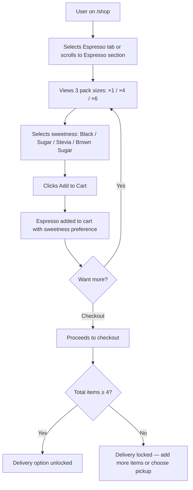

---

### 1.3 Bundle Purchase Flow

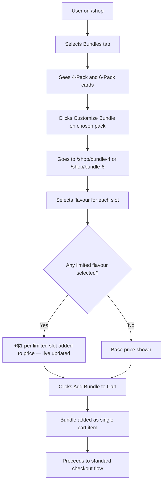

---

### 1.4 Promo Code Application

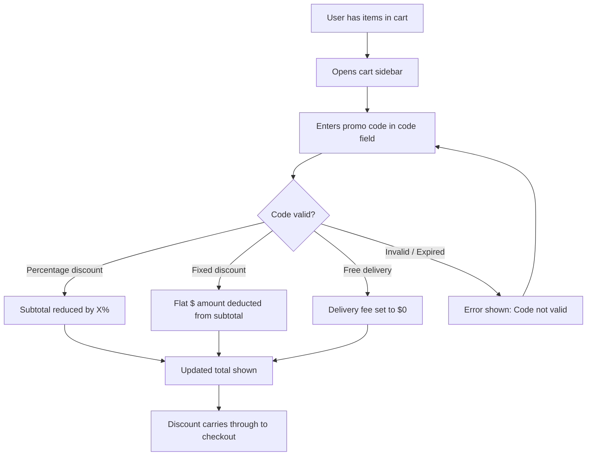

---

## 2. Event Customer Flows

### 2.1 First-Time Event Inquiry

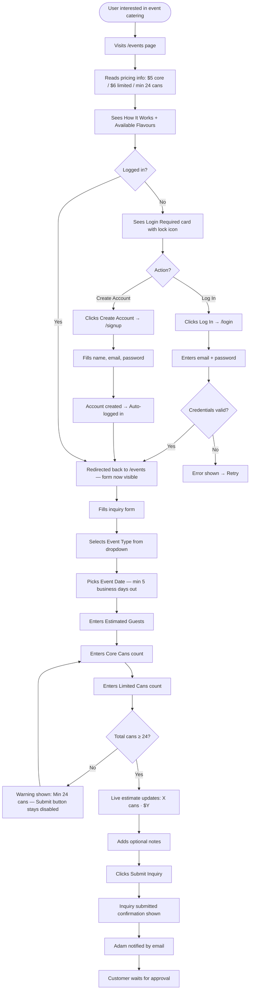

---

### 2.2 Post-Approval: AI Label Studio

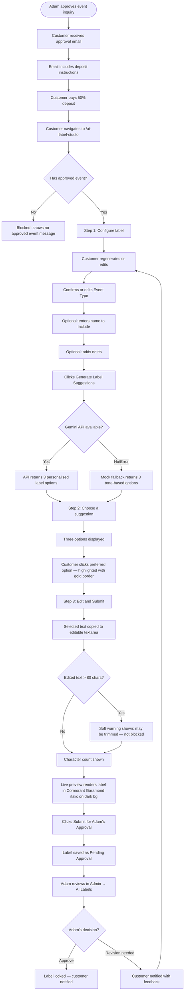

---

## 3. Wholesale Buyer Flows

### 3.1 Business Account Application

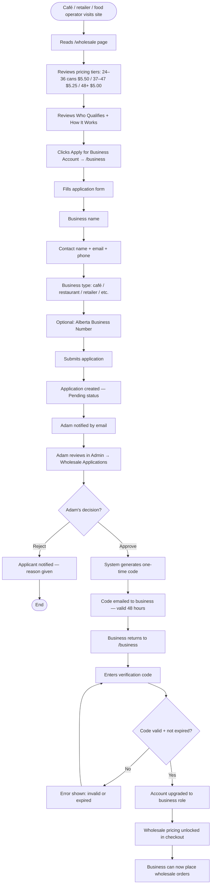

---

### 3.2 Wholesale Order Placement

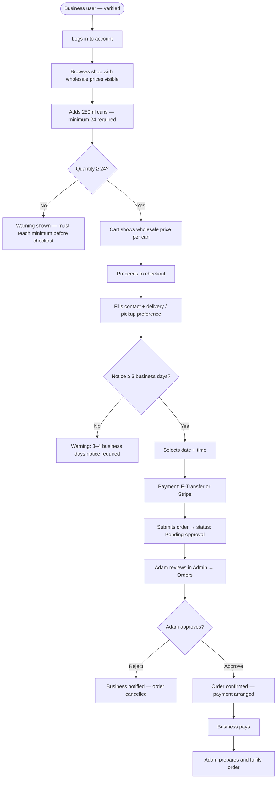

---

## 4. Admin (Adam) Flows

### 4.1 Admin Login

```mermaid
flowchart TD
    A([Adam visits /admin]) --> B{AdminAuthGuard check}
    B -- Session exists in localStorage --> C[Admin dashboard loads]
    B -- No session --> D[Redirected to /admin/login]
    D --> E[Enters email + password]
    E --> F{Credentials valid?}
    F -- No --> G[Error shown: Invalid email or password]
    G --> E
    F -- Yes --> H[Session saved to localStorage]
    H --> C[/admin dashboard]
    C --> I[Views stat cards and recent orders]
```

---

### 4.2 Daily Admin Workflow

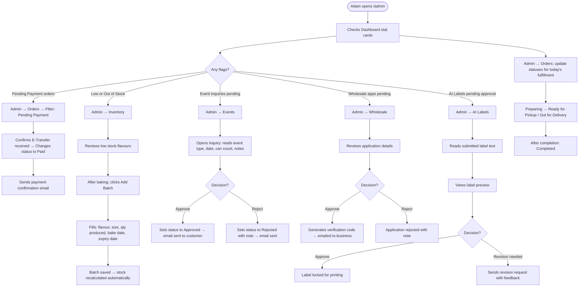

---

### 4.3 Order Status Lifecycle (Admin)

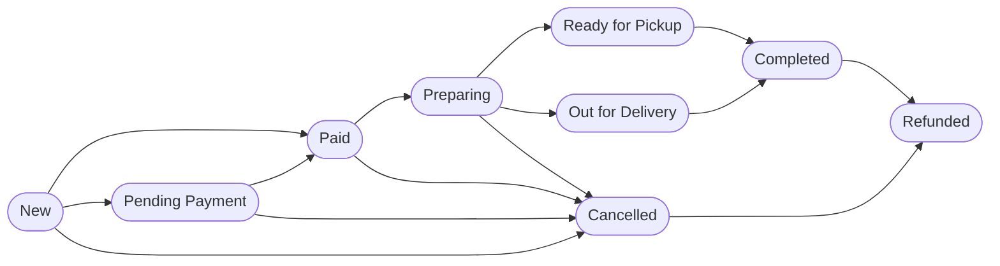

---

### 4.4 Product & Inventory Management

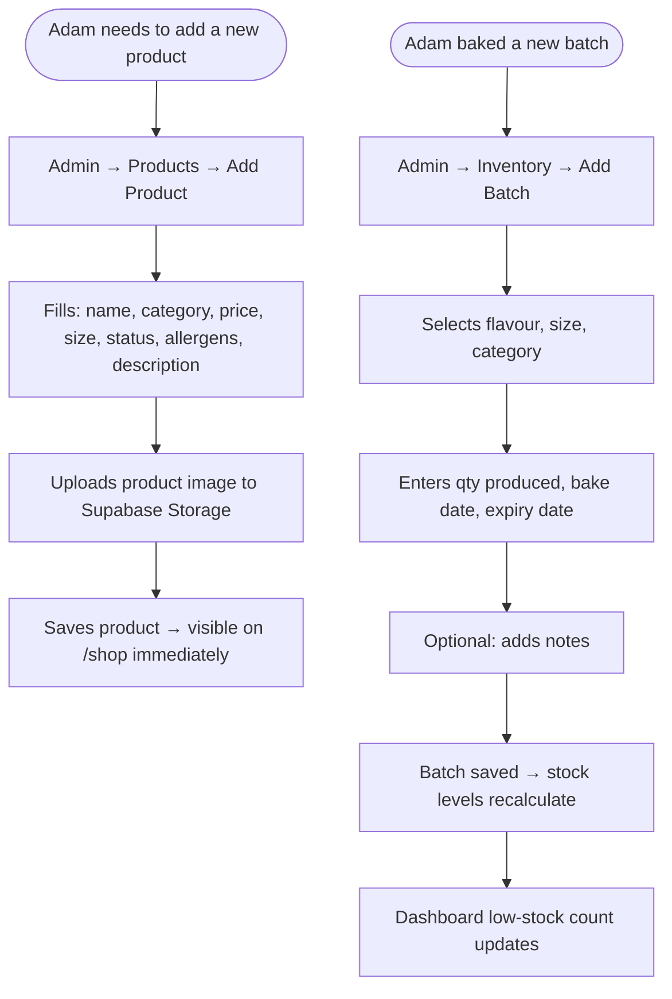

---

### 4.5 Availability Management

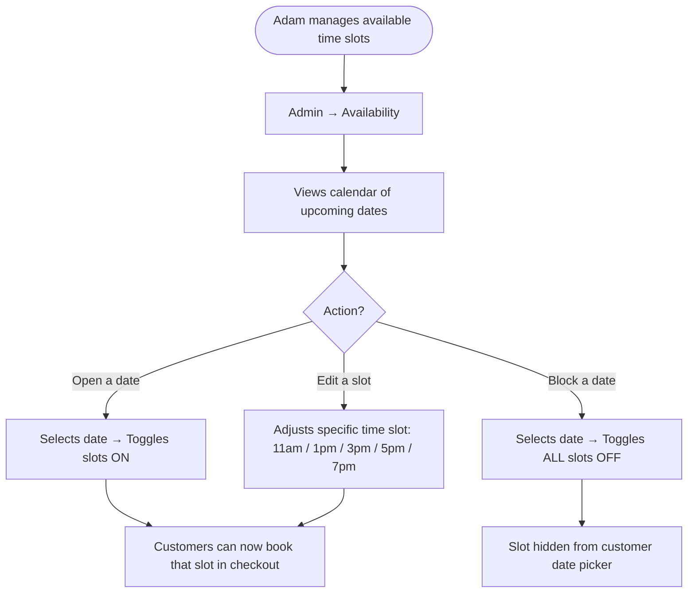

---

### 4.6 Promo Code Management

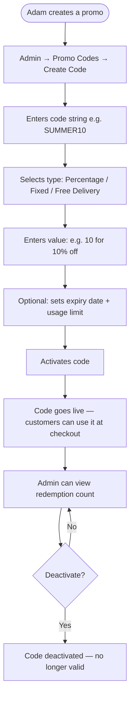

---

### 4.7 Settings Update

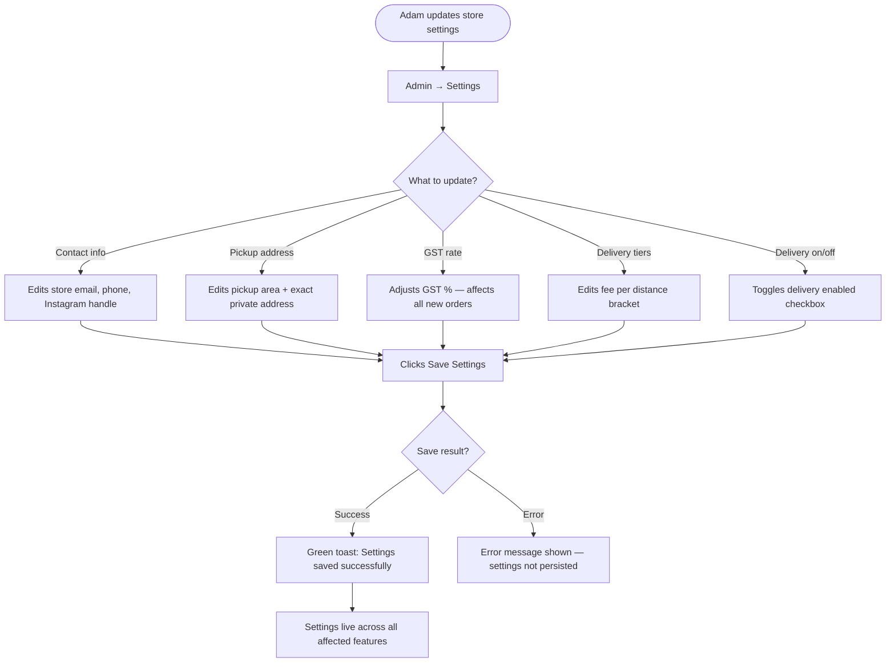

---

## 5. Cross-Cutting Flows

### 5.1 Day / Night Theme Toggle

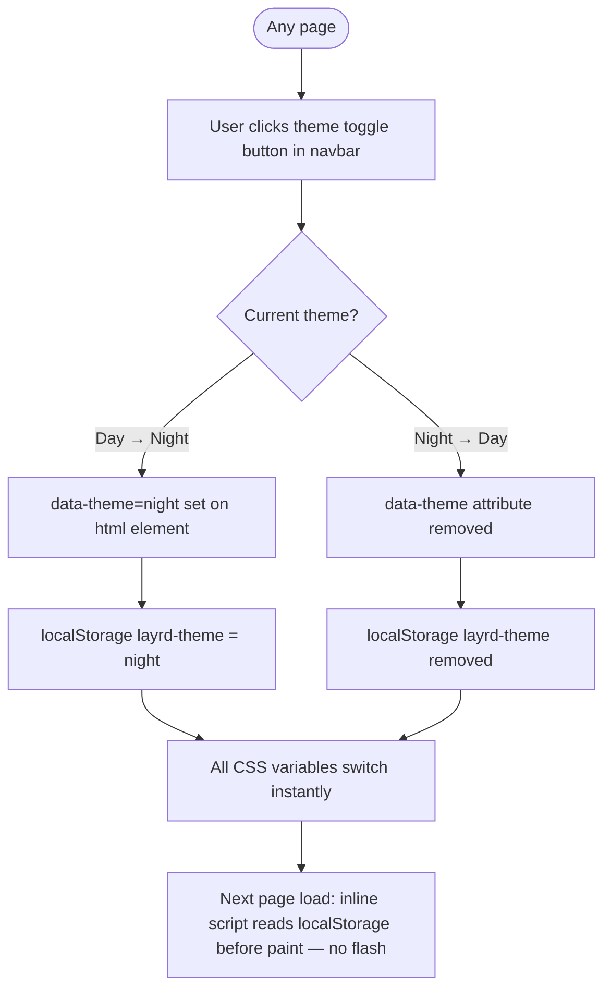

---

### 5.2 Cart Sidebar Interaction

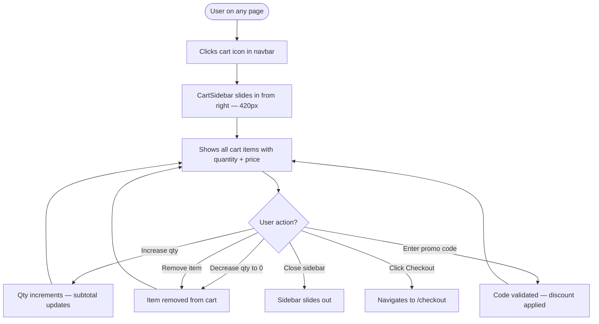

---

### 5.3 New User Registration Flow

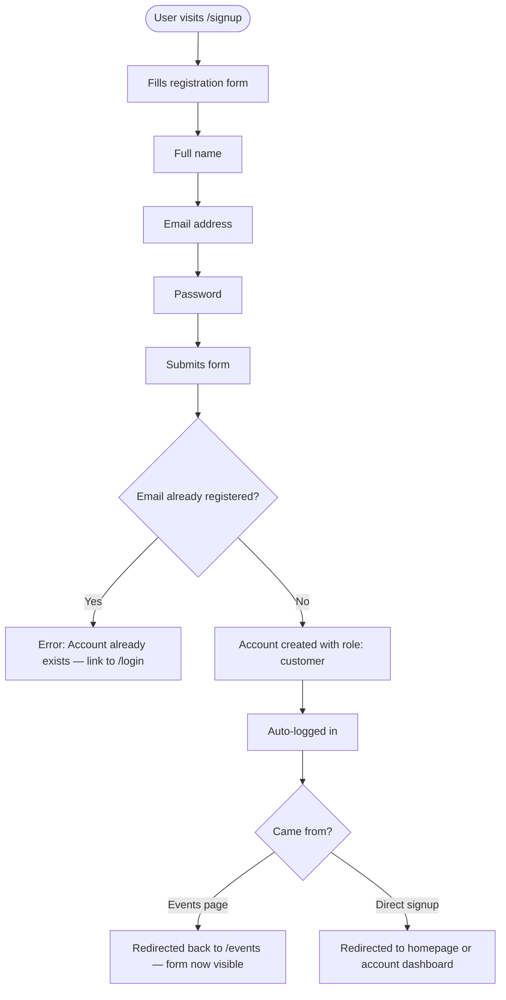

---

### 5.4 Forgot Password Flow

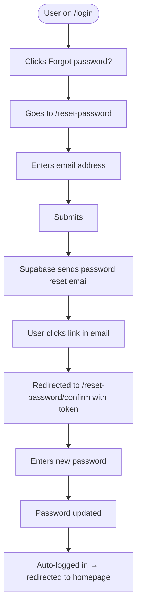

---

## 6. Error & Edge Case Flows

### 6.1 Out-of-Stock Product

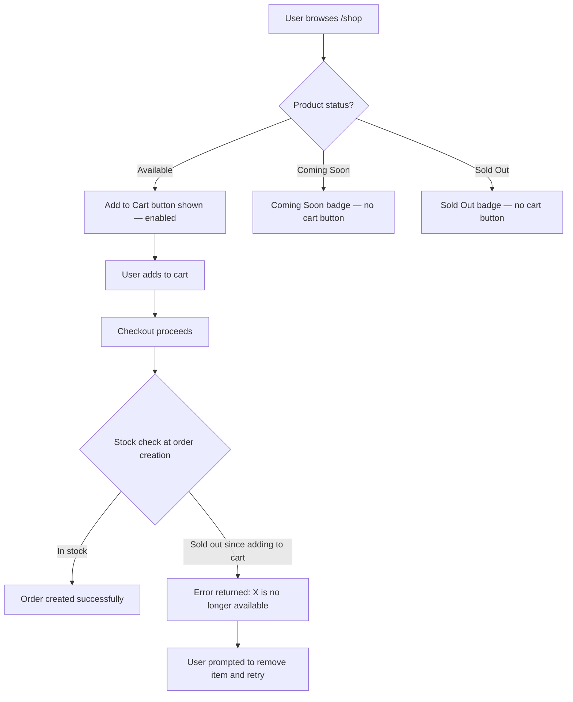

---

### 6.2 Delivery Outside Calgary

```mermaid
flowchart TD
    A[User selects Delivery in checkout] --> B[Enters address]
    B --> C[Clicks Check button]
    C --> D[API call to /api/delivery-fee]
    D --> E{Address within Calgary?}
    E -- Yes, within range --> F[Distance + fee shown in gold]
    F --> G[User continues checkout with delivery]
    E -- Outside Calgary --> H[Red warning: Outside Calgary — pickup only]
    H --> I[User switches to Pickup option]
    I --> J[Delivery fee cleared — checkout continues]
    E -- API error --> K[Estimated fee shown with note]
    K --> G
```

---

### 6.3 Event Inquiry Below Minimum

```mermaid
flowchart TD
    A[User filling event inquiry form] --> B[Enters Core Cans + Limited Cans]
    B --> C{Total cans < 24?}
    C -- Yes --> D[Live estimate shows red warning: Min 24 cans]
    D --> E[Submit button disabled]
    E --> B
    C -- No → exactly 24+ --> F[Estimate shows total + price in gold]
    F --> G[Submit button enabled]
    G --> H[User submits inquiry]
```

---

## 7. Page Transition Map

This shows how pages connect to each other via navigation links and user actions.

```mermaid
flowchart TD
    HOME["/\nHomepage"] --> SHOP["/shop\nShop"]
    HOME --> EVENTS["/events\nEvents"]
    HOME --> WHOLESALE["/wholesale\nWholesale"]

    SHOP --> CART["Cart Sidebar"]
    SHOP --> BUNDLE4["/shop/bundle-4\nBundle 4-Pack"]
    SHOP --> BUNDLE6["/shop/bundle-6\nBundle 6-Pack"]
    BUNDLE4 --> CART
    BUNDLE6 --> CART

    CART --> CHECKOUT["/checkout\nCheckout"]
    CHECKOUT --> CONFIRMATION["/confirmation\nConfirmation"]
    CHECKOUT --> STRIPE["Stripe Hosted Checkout"]
    STRIPE --> CONFIRMATION

    EVENTS --> LOGIN["/login\nLogin"]
    EVENTS --> SIGNUP["/signup\nSignup"]
    LOGIN --> EVENTS
    SIGNUP --> EVENTS
    LOGIN --> HOME
    SIGNUP --> HOME

    EVENTS --> AILABEL["/ai-label-studio\nAI Label Studio"]

    WHOLESALE --> BUSINESS["/business\nBusiness Account"]

    HOME --> FAQ["/faq\nFAQ"]
    HOME --> CONTACT["/contact\nContact"]
    HOME --> LOGIN

    ADMINLOGIN["/admin/login\nAdmin Login"] --> ADMIN["/admin\nDashboard"]
    ADMIN --> ORDERS["/admin/orders\nOrders"]
    ADMIN --> PRODUCTS["/admin/products\nProducts"]
    ADMIN --> INVENTORY["/admin/inventory\nInventory"]
    ADMIN --> ADMINEVENTS["/admin/events\nEvent Inquiries"]
    ADMIN --> ADMINWHOLESALE["/admin/wholesale\nWholesale"]
    ADMIN --> BIZCODE["/admin/business-codes\nBiz Codes"]
    ADMIN --> PROMO["/admin/promo-codes\nPromo Codes"]
    ADMIN --> ADMINFAQ["/admin/faq\nFAQ"]
    ADMIN --> AVAIL["/admin/availability\nAvailability"]
    ADMIN --> ADMINAI["/admin/ai-labels\nAI Labels"]
    ADMIN --> SETTINGS["/admin/settings\nSettings"]
```

---

## 8. Notification Flow Summary

Every action that generates an email notification:

| Trigger | Who Gets Email | Content |
|---|---|---|
| Order placed (any payment) | Customer | Order #, items, total, pickup/delivery info, storage reminder |
| Order placed | Adam | New order notification: customer, items, total, payment method |
| E-Transfer order: Adam marks Paid | Customer | Payment confirmed + order now being prepared |
| Order status → Ready for Pickup | Customer | "Your LÄYRD order is ready" |
| Event inquiry submitted | Adam | Inquiry details: event type, date, cans, customer info |
| Event inquiry approved | Customer | Approval confirmed + 50% deposit instructions |
| Event inquiry rejected | Customer | Rejection with Adam's note |
| AI label approved | Customer | Label confirmed — info about print timeline |
| AI label: revision requested | Customer | Feedback from Adam + link back to AI Label Studio |
| Business application approved | Business | One-time verification code + 48-hour expiry warning |
| Business application rejected | Business | Rejection with note |

---

*This document reflects user flows as designed in the current codebase. Update whenever a page, route, or feature changes.*  
*Cross-reference: [PRD.md](./PRD.md) · [TRD.md](./TRD.md) · [project-brief.md](./project-brief.md)*
